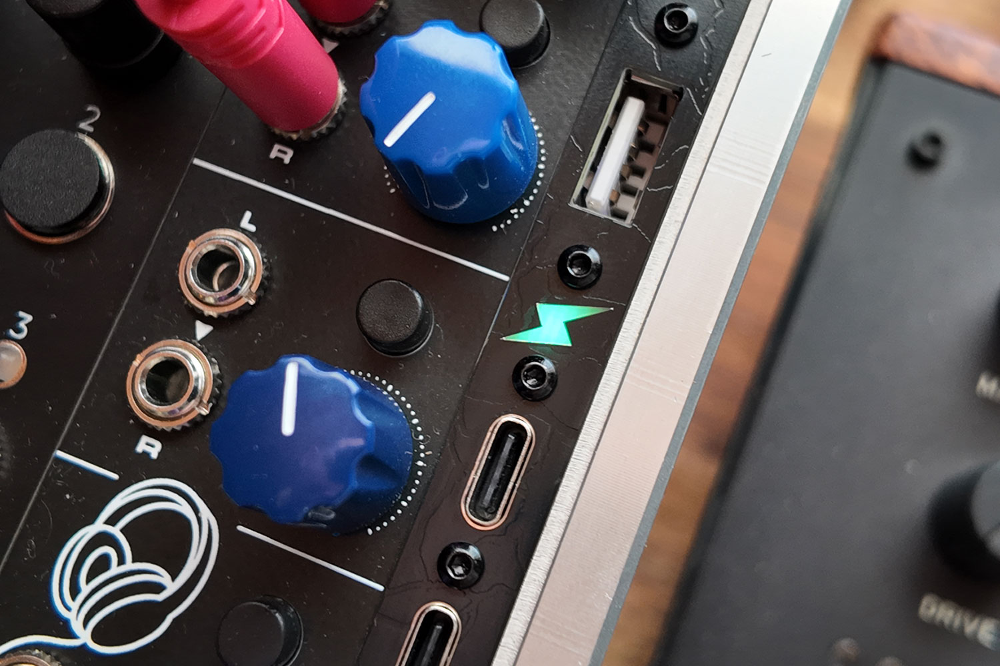
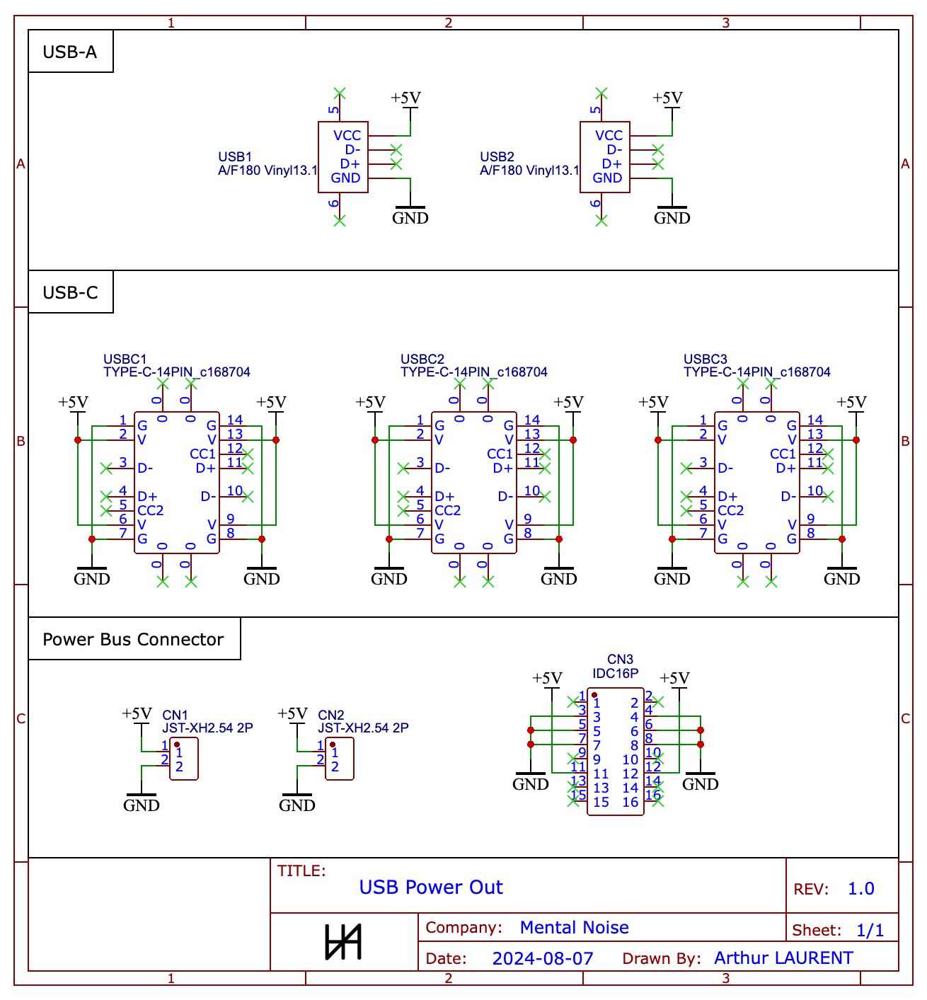

# USB Power Out

A tiny and simple 2 HP module to power any USB device using the power of your Eurorack:

* 2x USB-A (power only, no data)
* 3x USB-C (power only, no data)

Your power bus needs to output 5V for this module to work.  
The schematics include a 16 pins to 2 pins adapter which will soon be avaiable on Tindie too.

The module in itself doesn't provide any over-current protection so it's your responsibility to make sure you don't draw more current than what your power bus / power supply allow.

## Where to buy

The module will soon be available on [my Tindie store](https://www.tindie.com/products/mentalnoise/usb-power-out/) as a kit or fully assembled but feel free to build it yourself from scratch using the resources in this repository.

Have a look on [ModularGrid](https://modulargrid.net/e/mental-noise-usb-power-out) too!

## Schematics

All schematics can be found in the [schematics folder](./schematics).

The build guide is coming soon.

To import the schematics:
* Install EasyEDA at https://easyeda.com/ and download the standard edition
* Import [schematics.json](./schematics/schematics.json) in EasyEDA editor by clicking the document icon on the topbar, "Document" > "Open" > "EasyEDA Source", and select the json file

